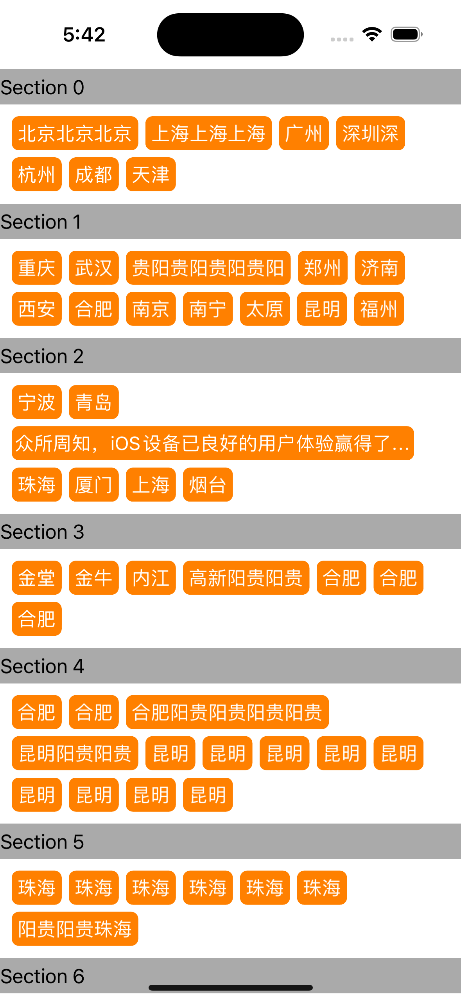

# Tags
UITableViewCell 嵌套 UICollectionViewCell ，标签列表页，城市列表页布局，针对多行换行等场景自动布局高度的一种方案和思路。

更复杂的场景需要自行优化。


### Swift实现：

[Swift/Tags/ViewController.swift](https://github.com/techsay/tags-list/blob/main/Demo/Tags/ViewController.swift)


### OC实现 ： 

[OC/TagListViewController.m](https://github.com/techsay/Tags/blob/main/Demo/TagsList/TagListViewController.m)

> 1、针对UITableViewCell 嵌入 ScrollView 的场景，因为 ScrollView 高度是动态的，而 ScrollView 中 tags view 根据数量和宽度不同需要自动换行。
>
> 2、tags 居左显示，使用 **pod** **'UICollectionViewLeftAlignedLayout'**


##### 方案1:本示例

```
1、通过 UITableViewCell 中重写 systemLayoutSizeFittingSize:xx:xx: 方法来更新子view的高度
2、通过 UICollectionViewCell 中 sizeForItemAtIndexPath: 计算单个 tag 的size 
```


##### 方案2: （对子View约束严格，稍有不慎会导致兼容问题）

```
1、通过 layout.estimatedItemSize 设置自动计算布局高度
2、通过 UICollectionViewCell 中 preferredLayoutAttributesFittingAttributes: 计算单个 tag 的size 
```


##### 方案3: 

```
1、通过 KVC [xx addObserver:self forKeyPath:@"contentSize" xx] 监听UICollectionViewCell 的 高度变化
2、通过 observeValueForKeyPath: 代理方法实现，通知UITableViewCell 进行高度更新  
```


##### 效果图：




